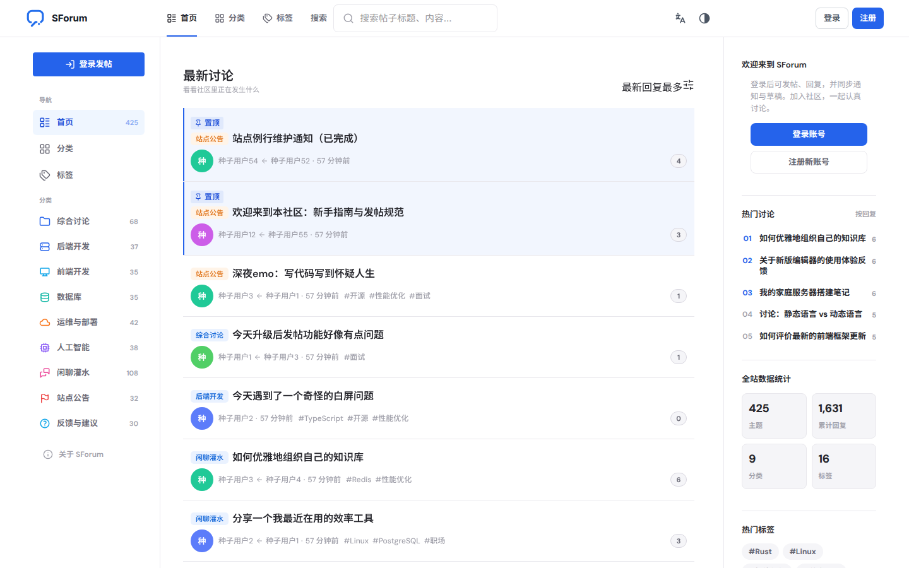
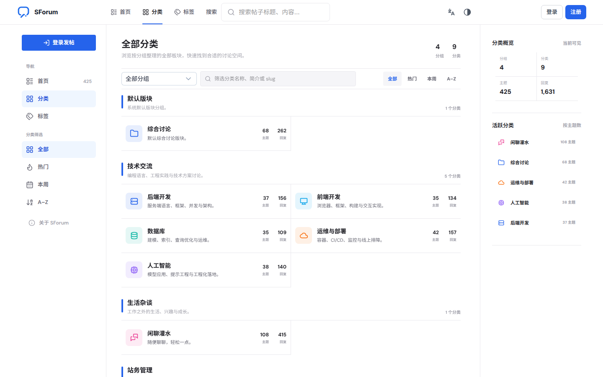
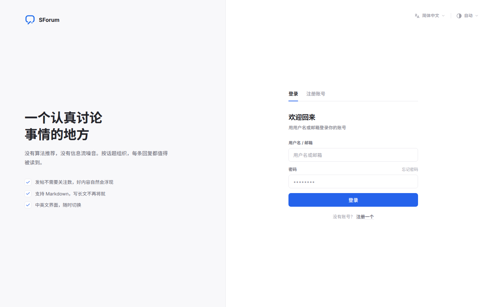
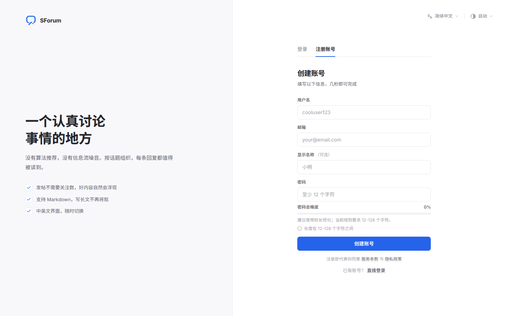
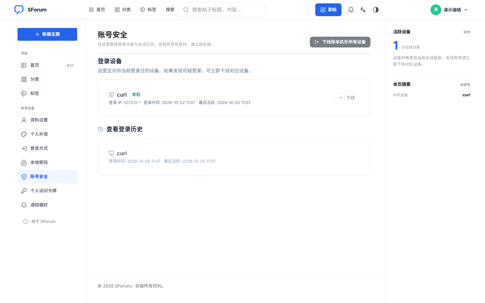
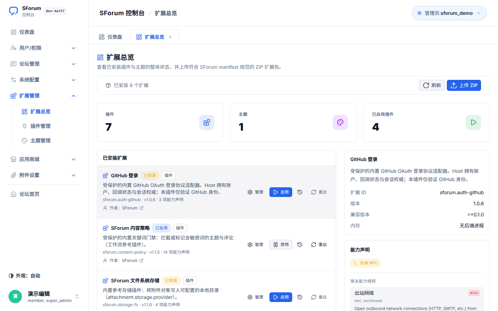

# SForum 文档（简体中文）

[English](../en-US/README.md) · [文档总入口](../README.md)

SForum 是可维护、插件优先的开源论坛框架：核心做宿主与契约，垂直能力与厂商逻辑走扩展。

## 界面预览

### 论坛首页
主题流、分类导航与站点实时统计一目了然。

### 分类浏览
按版块分组查看全部分类，以及每个分类的主题与回复数。

### 话题与讨论
正文、标签与楼中楼回复；右栏的扩展位由运行时主题注入。

### 发帖编辑器
富文本工具栏、草稿控制、发布前检查与发布设置同屏完成。

### 注册与登录
账号登录与注册、密码强度校验，支持中英文界面与外观切换。

### 账户安全
登录设备、活跃会话与登录历史，发现异常可立即下线。

### 管理后台 · 扩展总览
插件与主题状态、宿主能力声明、ZIP 上传一站式查看。

## 按角色阅读

| 你是… | 从这里开始 |
| --- | --- |
| 第一次跑起来 | [快速开始](./getting-started.md) |
| 站长 / 运营 | [使用说明](./usage/README.md) |
| 贡献者 / 二次开发 | [开发指南](./development/README.md) |
| 运维上线 | [生产部署](./deployment.md) |
| 插件 / 主题作者 | [扩展概览](./usage/extensions.md) → [技术参考](../extensions/authoring-guide.md) |
| 了解产品与架构 | [产品说明](./product.md) · [架构](./architecture.md) · [路线图](./roadmap.md) |

## 目录

### 使用

- [使用说明总览](./usage/README.md)
- [首次注册与超级管理员](./usage/first-login.md)
- [账户与安全](./usage/account-security.md)
- [管理后台](./usage/admin.md)
- [论坛日常](./usage/forum.md)
- [通知](./usage/notifications.md)
- [搜索](./usage/search.md)
- [扩展与主题（运营侧）](./usage/extensions.md)

### 开发

- [开发总览](./development/README.md)
- [环境搭建](./development/setup.md)
- [日常工作流](./development/workflow.md)
- [开发者 CLI](./development/cli.md)
- [API 使用](./development/api.md)
- [测试与质量门禁](./development/testing.md)
- [仓库地图](./development/repository.md)

### 其他

- [生产部署](./deployment.md)
- [架构](./architecture.md)
- [产品说明](./product.md)
- [路线图](./roadmap.md)

## 技术参考（语言中立 / 路径固定）

以下路径被 CI 与生成器引用，请勿随意移动：

- [插件编写指南](../extensions/authoring-guide.md)
- [Host API v2](../extensions/host-api-v2.md)
- [运行时主题](../extensions/runtime-themes.md)
- [生成目录 catalogs](../extensions/catalogs/)
- [V3 平台文档](../extensions/v3/)

### 扩展开发（中文翻译）

- [插件路由定义（routes）](./extensions/routes.md)
- [构建与加载循环（build-and-load）](./extensions/build-and-load.md)

> 英文原文（路径稳定）位于 `docs/extensions/`；字段名与命令以原文和代码为准。

## 与 knowledge 的分工

| 位置 | 用途 |
| --- | --- |
| `docs/zh-CN` / `docs/en-US` | 给人读的使用与开发手册 |
| `docs/extensions` | 扩展契约与生成目录 |
| `knowledge/` | 决策、模块状态、会话交接（偏内部记忆） |
