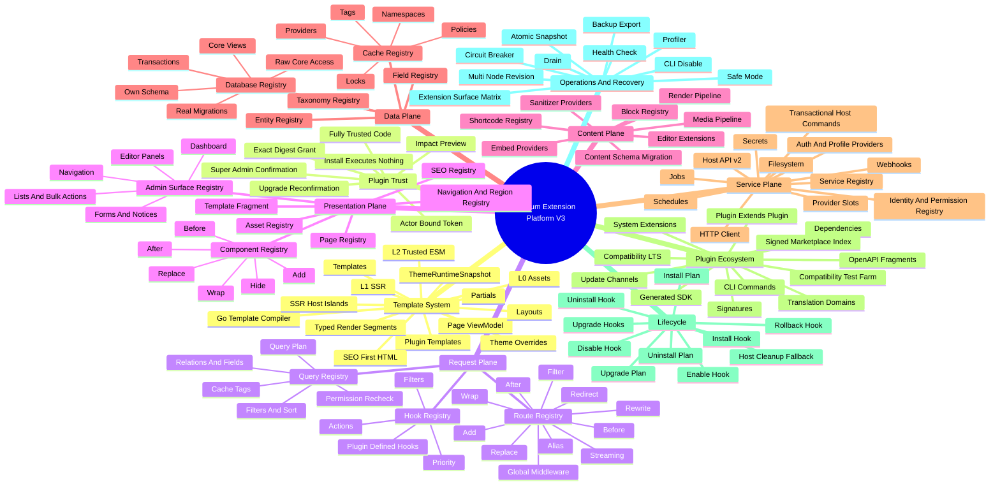

# Trusted Plugin And Theme Platform V3

Date: 2026-07-13  
Status: Accepted direction; implementation has not started

## Context

SForum currently has a useful but deliberately narrow extension platform:

- backend plugins run as HashiCorp go-plugin subprocesses;
- Host API v1 exposes a small capability-gated RPC surface;
- plugin HTTP routes are namespaced under `/extensions/{id}/*`;
- migrations are checksum ledger entries and do not execute SQL;
- public UI contributions are host-rendered descriptors;
- runtime themes provide L0 CSS and constrained L1 HTML around a small host
  island catalog;
- public L2 JavaScript is disabled.

This supports providers, workflow filters, settings, jobs, events, and small UI
contributions, but it does not provide the application-level flexibility of
WordPress, Typecho, Discuz, Flarum, or NodeBB. In particular, a plugin cannot
fully compose routes, own a database schema, replace a component, extend
another plugin, control cache policy, add content types, or implement its own
install and uninstall behavior.

Uploaded backend binaries already represent host code execution. The current
capability catalog governs supported Host API calls, but it is not an OS-level
sandbox. The product must therefore be explicit: a user who enables executable
third-party code is making a full trust decision.

## Current-To-Target Contract

The tables and mind map in this section are the authoritative, one-to-one
baseline for the V3 task book. Later summaries may group rows, but must not
remove or narrow any target capability recorded here.

### Template And Theme Mechanism Comparison

| Surface | Current mechanism | V3 target mechanism |
| --- | --- | --- |
| Page ownership | Most public pages still live in `apps/web` | Theme packages own all public presentation |
| Template executor | Go API uses a custom regex replacement renderer | Go `html/template` |
| Load timing | Template files are read per request | Read once during static install/activation preparation |
| Compilation | None | Parse and compile by package digest and compiler version |
| Runtime cache | None | Immutable `ThemeRuntimeSnapshot` |
| Provider lookup | PostgreSQL is queried on the request path | Provider bindings resolve from the in-memory snapshot |
| Template safety | Repeated bluemonday sanitization | Static inspection at install plus contextual escaping |
| Layout | Core Nuxt layout | Theme-owned `layouts/` |
| Partial | Almost none | Theme-owned `partials/` |
| Control syntax | Only simple `{{key}}` replacement | Standard `if`, `range`, `with`, `template`, and `block` actions |
| Page data | Distributed across Vue page requests | Versioned Page ViewModels |
| Default theme | Core pages are the effective default implementation | `sforum-default` is a complete theme package |
| Missing-template fallback | Whole-page core fallback | Active theme override, plugin template, default theme, then emergency output |
| Host islands | Four coarse components | Complete SSR Island Registry |
| Island parsing | Frontend regex splits HTML | Typed Render Segments |
| L0 | CSS and tokens | CSS, tokens, fonts, images, and locales |
| L1 | HTML shell | Complete SSR pages, layouts, partials, and fragments |
| L2 | Disabled | Author-prebuilt, digest-authorized ESM |
| Plugin templates | Incomplete | Plugins may ship pages and fragments |
| Theme override of plugin templates | Unsupported | `templates/plugins/{pluginId}` with contract checks |
| SEO | Core pages render SSR metadata/content | Theme templates and Host Islands produce complete SSR SEO output |
| Lazy loading | May depend on core hydration | Only interactive L2 may load lazily; indexable content never does |
| Theme switch | Database, Registry, and approval state are split | Prewarm and atomically swap the runtime snapshot |
| Nuxt build | Not required | Still not required |
| Request-time template I/O | Present | Zero |
| Request-time theme database lookup | Present | Zero |
| Browser without JavaScript | Some behavior depends on core hydration | Body, lists, comments, and pagination remain complete and usable |

### Plugin Mechanism Comparison

| Surface | Current mechanism | V3 target mechanism |
| --- | --- | --- |
| Trust | Capability confirmation | Full trust for the exact digest after second confirmation |
| Package install | Validate and store | Produce a complete impact preview and execute no package code |
| Enable | `confirmCapabilities: true` | Actor-bound, one-use confirmation token |
| Backend runtime | HashiCorp go-plugin subprocess | Keep subprocess isolation and move to Protocol v2 gRPC |
| Extension surface coverage | Core-owned catalog with uneven coverage | Per-module Extension Surface Matrix with CI-enforced coverage and explicit non-extension reasons |
| Route add | `/extensions/{id}/*` only | Any declared path and HTTP method |
| Route alias | Unsupported | `alias` |
| Redirect | Unsupported | `redirect` |
| Internal rewrite | Unsupported | `rewrite` |
| Before processing | A few fixed filters | `before` plus global middleware |
| After processing | Observe events | `after` |
| Request/response filtering | Fixed-field allowlist | Versioned `filter` contracts |
| Handler wrapping | Unsupported | `wrap` |
| Handler replacement | Unsupported | `replace` |
| Streaming routes | Incomplete | SSE, WebSocket, multipart, and streaming responses |
| Route guard | Fixed core guard | Inherit Host guard by default or declare a trusted custom guard |
| Route conflict | Usually rejected | Deterministic priority plus administrator-selected provider |
| UI extension | Ten descriptor contribution points | Complete Component Registry |
| Admin surfaces | A few fixed pages and descriptor points | Admin Surface Registry for navigation, dashboards, forms, notices, editor panels, and detail regions |
| Admin lists and actions | Fixed host tables and actions | Typed columns, filters, row actions, bulk actions, exporters, and inspector contributions |
| Component actions | Add a few buttons/cards | `add`, `before`, `after`, `wrap`, `replace`, and `hide` |
| Component data | Host-fixed props | Prop and result filters |
| SSR fragments | Unsupported | Plugin Template Fragments and typed Render Segments |
| Frontend code | Admin micro-frontend only | Admin code plus trusted public L2 ESM |
| Asset injection | Very limited | Asset Registry with dependencies, scope, integrity, and deduplication |
| Navigation and regions | Core navigation and a few page slots | Navigation/Region Registry for menus, breadcrumbs, headers, footers, sidebars, and theme widget regions |
| Media pipeline | Storage provider and attachment hooks only | MIME policy, validation, scanning, metadata, transforms, variants, CDN URLs, jobs, and deletion lifecycle |
| Own database | None | Dedicated PostgreSQL schema and role |
| SQL migrations | Checksum ledger only | Lock, transact where possible, execute, and record in a ledger |
| Core data read | Small Host API surface | Query API, stable views, or explicitly trusted raw access |
| Core data mutation | Filters/providers | Command API or explicitly trusted raw core database access |
| Transactional core workflows | No plugin-owned cross-module unit of work | Versioned transactional Host Commands execute declared multi-step operations in one Host transaction |
| Own transactions | Unsupported | Supported |
| Custom entity | Entity metadata only | Entity Type Registry |
| Custom taxonomy | Unsupported | Taxonomy Registry |
| Custom fields | Entity metadata only | Field Schema, UI, validation, and indexing |
| Query pipeline | Fixed service queries | Query Registry for plan, filters, fields, relations, sort, pagination, result filters, permission recheck, and cache tags |
| Identity and permissions | Core-owned roles and permission catalog | Identity/Permission Registry for capabilities, role suggestions, user fields, sessions, risk hooks, and audit |
| Authentication and profile | Core-owned login, registration, and profile flows | Auth providers plus versioned registration, login, profile, recovery, and account-management extension surfaces |
| Actions and filters | Fixed catalog | Typed Hook Registry with priority |
| Plugin-defined hooks | Unsupported | Namespaced hooks supported |
| Plugin extends plugin | Very weak | Dependencies plus Service Registry |
| Custom blocks | Unsupported | Block Registry |
| Editor extension | Toolbar actions | Tiptap Node, Mark, and Command Registry |
| Shortcode and embed | Unsupported | Shortcode Registry plus Embed Providers |
| Content rendering | Core-fixed | Parse, render, and sanitize pipeline |
| Cache API | No plugin surface | Namespaces, tags, locks, and remember operations |
| Cache policy | Core-fixed | Key, TTL, bypass, and invalidation filters |
| Cache provider | Core Redis | Replaceable `cache.provider` |
| Provider slots | Partially mature | Plugins may define and consume providers |
| Jobs | River typed jobs | Versioned payloads with drain and migration policy |
| Schedules | Fixed Registry | Dynamic schedule registration |
| CLI | Core commands | Plugin Command Registry |
| OpenAPI | Plugin routes have no aggregate contract | OpenAPI fragments plus generated clients |
| Secrets | Ordinary settings | Dedicated Secret Store and rotation |
| Filesystem | No formal plugin space | Private files, temporary files, and static assets |
| HTTP client | `net.outbound` | Timeout, proxy, retry, SSRF controls, and credential injection |
| Localization | Manifest locale | Text domains, pluralization, overrides, and language packs |
| Settings lifecycle | Settings document without versioned data migration | Versioned settings schema, migration, defaults/reset, import/export, conditional fields, and secret references |
| Dependencies | Basic version constraints | Required, optional, conflict, and provides relationships |
| Compatibility policy | Package compatibility field with no long-lived platform contract | Host/Frontend API LTS windows, deprecation telemetry, shims, and automated compatibility test farm |
| Updates | Upload a new package | Preflight, signatures, impact comparison, and version rollback |
| Distribution | No authoritative signed extension index | Signed marketplace index, dependency resolution, compatibility reports, security notices, staged updates, and rollback |
| Deployment extensions | Built-ins and ordinary plugins only | Optional operator-managed system extension tier for early infrastructure providers, still bypassed by Safe Mode |
| Lifecycle | Enable, disable, and partial upgrade | Install, enable, disable, upgrade, rollback, and uninstall hooks |
| Uninstall | Host deletes managed content | Plugin `uninstall.plan` and `uninstall` lead cleanup |
| Data retention | Settings-level option | Preserve, export-then-remove, or fully remove |
| External cleanup | Host cannot discover it | Uninstall hook cleans webhooks, SaaS, and cloud resources |
| Failure recovery | Disable through API | Safe Mode, CLI disable, and snapshot rollback |
| Multi-node | Primarily single-node | Revision, migration-once, and node acknowledgement |
| Debugging | Logs and events | Route, Hook, SQL, Cache, and Component Profiler |
| Developer testing | `extension test` | One-command developer Host, Fake Host, fixtures, contract simulator, hot reload, Hook Explorer, and compatibility matrix |

## Architecture Mind Map

## Accepted Boundary Checklist

- Route Registry v1 includes every route action, including `wrap` and `replace`,
  for any declared path and HTTP method.
- Trusted plugins inherit Host guards by default and may declare a custom guard.
- Trusted plugins may request raw core database access.
- Plugins may replace public and admin components.
- Plugins may define hooks, components, services, and provider slots for other
  plugins to extend.
- Every core module publishes an Extension Surface Matrix or records why a
  particular route, hook, query, component, media, identity, or cache surface is
  intentionally closed; CI detects undocumented coverage regressions.
- Admin Surface, Query, Identity/Permission, Media Pipeline, and Navigation/
  Region registries are first-version platform capabilities, not optional
  ecosystem follow-ups.
- Plugins may declare permissions and recommended role mappings but can never
  silently grant their permissions to actors or roles.
- Themes may override plugin templates but cannot alter the plugin's business
  data contract.
- Primary SEO content is always SSR; L2 may only enhance interaction.
- Plugin uninstall hooks lead business and external-resource cleanup; Host
  cleanup only covers host-managed fallback.
- Enabling uploaded executable plugins makes them fully trusted code; capability
  declarations are not represented as a security sandbox.
- Safe Mode, CLI disable, and snapshot rollback ship with full override power.
- Five independent reference plugins must prove SEO, identity, custom content,
  media, and commerce/workflow extension without modifying core product code.

## Decision

### 1. Use an explicit full-trust model for executable extensions

Installing a package never executes its code. Enabling an uploaded package that
contains backend code, public/admin executable frontend code, raw database
access, custom route guards, or other high-risk declarations requires an active
`super_admin` to complete a second confirmation.

"Package install" means upload, static validation, impact preview, and inert
storage. An actor with the normal plugin/theme management permission may perform
that operation. Lifecycle `install.plan` and `install` execution hooks are
deferred to the first trusted enable transaction and cannot run before the
exact-artifact `super_admin` confirmation. The same rule applies before an
upgrade executes new code, imports executable frontend modules, or runs
migrations.

The confirmation is server-issued, one-use, short-lived, and bound to:

- actor id;
- extension id and version;
- package and executable frontend digests;
- declared routes, hooks, migrations, providers, components, and capabilities;
- requested database and request authority;
- Host/Frontend API contract versions.

After confirmation, executable code is treated as fully trusted for the exact
artifact. Capability declarations remain valuable for disclosure, compatibility,
dependency resolution, and Host API shaping, but SForum does not describe them
as a security sandbox. Any relevant artifact or authority change invalidates the
grant. A normal restart of the same digest does not.

### 2. Make core behavior registry-composable

Core implementations become default providers in versioned registries. Trusted
plugins may contribute to the same registries with deterministic priority,
conflict inspection, digest-bound activation, and atomic snapshots.

The platform owns at least these registry families:

- Route and Middleware;
- Hook, Action, and Filter;
- Page, Template, Component, Admin Surface, Navigation, Region, and Asset;
- Content Block, Editor, Render, Embed, and Sanitizer;
- Entity, Taxonomy, Field, Query, Database, Media, and Cache;
- Service, Provider, Job, Schedule, Webhook, and Command;
- Identity, Auth, Permission, Secret, Audit, Package, Dependency, Update,
  Marketplace, and Translation.

Plugins may define namespaced hooks, component points, services, providers,
routes, and commands that other plugins consume. Required, optional, conflict,
and provides relationships are versioned and resolved before activation.

### 3. Support the complete route action set in the first platform version

Route Registry v1 supports:

- `add`;
- `alias`;
- `redirect`;
- `rewrite`;
- `before`;
- `after`;
- `filter`;
- `wrap`;
- `replace`;
- global middleware;
- SSE, WebSocket, multipart upload, and streaming responses.

An `add` contribution may claim any declared public, admin, or API path and HTTP
method; it is not restricted to `/extensions/{id}/*`. Stable route ids and
contract versions remain the composition identity. Safe-mode startup and
out-of-band CLI recovery are not Registry routes and cannot be replaced.

Core routes and plugin routes use stable route ids and contract versions rather
than treating raw paths as the long-term API. Conflicts are deterministic and
visible to administrators. One replace provider is selected explicitly; ordered
before/after/filter contributions compose by stable priority.

Core authentication, CSRF, actor, and permission guards are inherited by
default. A fully trusted plugin may declare a custom guard or raw request
authority after an additional high-risk confirmation. Once a route uses a
plugin-owned guard or replacement handler, SForum cannot claim that core policy
protects that route.

The HTTP recovery control plane is not the safety boundary. Recovery remains
available out of band through safe-mode startup and CLI disable commands even
when a plugin breaks all normal application and admin routes.

### 4. Add a real plugin database platform

The default database grant creates a plugin-specific PostgreSQL role and schema.
The host executes declared migrations with checksums, advisory locking, ledger
state, transaction handling where PostgreSQL permits it, dry-run inspection,
and explicit backup guidance.

Database authority is disclosed in tiers:

- own schema and transactions;
- stable read-only core views;
- typed Host Query/Command APIs;
- fully trusted raw core database access;
- core schema migration authority for explicitly approved kernel-level work.

Raw core access is allowed in platform v1 because the accepted goal is
WordPress-class flexibility. It is never presented as compatible or safe by
default. Plugins that use it must declare a narrow SForum compatibility range,
and core upgrades may block until compatibility is confirmed.

### 5. Replace Host API v1 with a typed v2 protocol

Host API v2 uses HashiCorp go-plugin's gRPC transport plus Protobuf contracts.
It exposes versioned domain query/command services, database and cache services,
route/hook registration, jobs, schedules, audit, secrets, files, HTTP, and
service discovery. A compatibility adapter keeps existing v1 reference plugins
working during migration.

The protocol and generated SDKs should permit non-Go plugin implementations
without weakening the handshake, capability disclosure, timeout, health, and
lifecycle contracts.

### 6. Make themes complete, buildless view packages

Core retains routing, Page ViewModel construction, SEO policy, permissions, and
interactive host contracts. Public presentation moves into theme packages.

L1 uses the Go standard library `html/template`, parsed and validated during
install/activation and stored in an immutable digest-keyed
`ThemeRuntimeSnapshot`. Public requests perform no theme file I/O, template
parsing, or theme/provider database lookups.

The template contract includes the standard `if`, `range`, `with`, `template`,
and `block` actions with a restricted Host FuncMap and bounded execution.

Theme packages own layouts, templates, partials, assets, locales, and optional
trusted L2 ESM. Missing output resolves through:

1. active theme override for a plugin template;
2. plugin-supplied template;
3. active/default theme template;
4. minimal core emergency output.

Theme overrides change presentation only. They must consume the versioned
plugin Page ViewModel/render contract and cannot rewrite the plugin's business
data contract.

Nuxt remains the SSR shell and host-island runtime. Go rendering returns safe
HTML segments, typed island descriptors, and an SEO payload. Primary indexable
content is present in the first HTML response; L2 only adds progressive
interaction. With JavaScript disabled, body content, lists, comments, links, and
pagination remain complete and usable.

### 7. Add full component and content composition

Component Registry supports `add`, `before`, `after`, `wrap`, `replace`,
`hide`, prop filters, and result filters against stable component ids. Plugin
SSR output uses template fragments or typed render segments; author-prebuilt
digest-trusted ESM supplies client interaction.

Content extensibility includes blocks, shortcodes, embeds, Tiptap nodes/marks/
commands, render filters, sanitizers, content schema versions, and migrations.
This is required for plugins to introduce new product content rather than only
decorate existing forum pages.

### 8. Treat cache, assets, APIs, and plugins themselves as extension surfaces

Plugins receive namespaced cache operations, tags, distributed locks, remember,
route/page cache policy filters, invalidation, and provider replacement.

Asset Registry manages script/style handles, dependencies, versions, module
mode, loading strategy, integrity, CSP declarations, page/component scope, and
deduplication. Package-local prebuilt artifacts are the default; remote assets
require explicit authority.

Plugin routes may publish modular OpenAPI fragments. The host validates and
aggregates them for documentation and generated clients. Plugins may expose
versioned services, hooks, templates, components, and providers for other
plugins.

### 9. Make lifecycle hooks authoritative for plugin-owned cleanup

Lifecycle v2 includes plan and execution hooks for install, enable, disable,
upgrade, rollback, and uninstall. `uninstall.plan` reports database, core data,
files, cache, jobs, schedules, external subscriptions, cloud resources, search
indexes, user content, export support, and irreversible effects.

Package upload/static installation never invokes these executable hooks. On the
first trusted enable, the lifecycle state machine runs deferred `install.plan`
and `install` before `enable`, after confirmation and before atomic activation.

The plugin's `uninstall` hook is the primary cleanup owner for business and
external resources. The host unregisters routes/components/hooks, revokes
tokens and credentials, and cleans host-managed namespaces as a safety net.
Hooks are digest-bound, idempotent, resumable, audited, and retryable. Forced
uninstall cannot promise that external resources were removed.

### 10. Ship recovery and observability with full override power

The same platform version that enables route/component/database overrides must
also provide:

- `SFORUM_SAFE_MODE=1`;
- CLI disable for one extension or all third-party extensions;
- staged start, health check, atomic registry snapshot, drain, and rollback;
- circuit breakers and timeouts;
- route/hook/RPC/SQL/cache/component tracing;
- a developer inspector for provider selection and fallback reasons;
- multi-node desired/active revision convergence and migration-once semantics;
- queued job payload versioning and upgrade drain/migration policy.

### 11. Treat extension density, compatibility, and distribution as platform features

Registry infrastructure is not sufficient unless real product surfaces expose
stable points. Every core module maintains an Extension Surface Matrix covering
its routes, hooks, queries, components, permissions, cache invalidation, jobs,
and lifecycle behavior. CI detects removed or undocumented points. A closed
surface requires an explicit security, integrity, or ownership reason.

The first V3 platform includes dedicated registries rather than forcing all
behavior through generic components or raw routes:

- Admin Surface Registry for navigation, dashboard widgets, list columns,
  filters, row/bulk actions, forms, notices, editor panels, and detail regions;
- Query Registry for typed query plans, filters, relations, fields, sorting,
  pagination, result filtering, permission rechecks, and cache tags;
- Identity/Permission Registry for capabilities, role suggestions, user fields,
  auth/profile/recovery providers, sessions, risk hooks, and audit;
- Media Pipeline for MIME policy, validation, scanning, metadata, transforms,
  variants, CDN URLs, background work, and deletion;
- Navigation/Region Registry for menus, breadcrumbs, headers, footers, sidebars,
  and theme-defined widget regions;
- versioned transactional Host Commands for common multi-module writes that must
  commit atomically without making raw core database access the normal path.

Host and Frontend APIs publish LTS support windows, deprecation telemetry, shims,
and an automated compatibility test farm. Distribution uses a signed marketplace
index with dependency resolution, compatibility reports, security notices,
staged updates, provenance/SBOM data, and rollback. An optional operator-managed
system extension tier may provide early infrastructure services, but Safe Mode
always bypasses it.

Platform completion requires independent SEO, identity, custom-content, media,
and commerce/workflow reference plugins. A single showcase plugin cannot prove
surface density or author ergonomics.

## Permission And Policy Consequences

- Delegated plugin/theme managers may upload, statically inspect, and store an
  inert package without executing it.
- Only active `super_admin` actors may first execute or newly trust uploaded
  server code, run its lifecycle hooks or migrations, apply executable upgrades,
  grant custom guards/raw core database access, or import trusted frontend code.
- Delegated managers may inspect, configure, disable, and operate built-in or
  already-trusted extensions only where existing permissions allow.
- Plugins may declare permission keys and recommended role mappings, but Host
  policy owns assignment; install/enable never silently grants a plugin's
  permissions to an actor or role.
- Core API policy remains authoritative for core-owned handlers. A trusted
  replacement handler or custom guard owns its declared policy and risk.
- Frontend hiding, capability copy, signatures, and confirmations do not
  sandbox malicious code.
- Safe mode and CLI recovery must not depend on normal plugin routes or frontend
  components.

## Supersedes And Preserves

This decision revises:

- `2026-07-06-core-framework-plugin-first-architecture`: trusted plugins may
  compose and replace core behavior through registries after explicit trust;
- `2026-07-06-plugin-event-extension-points`: the host catalog is no longer the
  only hook namespace because plugins may define versioned extension points;
- `2026-07-12-host-api-v1-capabilities`: v1 remains a compatibility surface,
  while v2 becomes the target;
- `2026-07-13-runtime-page-registry-themes`: `html/template`, complete theme
  ownership, trusted L2, and plugin-template overrides replace the constrained
  shell-only target;
- the remediation decision to disable public L2: disabling was correct for the
  incomplete loader, but digest-trusted prebuilt L2 is now an accepted target;
- migration ledger-only behavior: real plugin migrations are now required.

This decision preserves:

- plugin-first product verticals and provider-neutral core models;
- exactly one active public theme;
- no site build or Nitro restart for normal theme activation;
- core-owned SSR, SEO policy, route identity, Page ViewModels, and fallback;
- exact-digest trust invalidation;
- backend subprocess crash isolation;
- API/OpenAPI and permission-aware development requirements;
- buildless Schema/Actions settings and Schema fallback.

## Consequences

### Positive

- Plugins can implement complete products instead of only adapters and badges.
- Themes can own the public presentation without rebuilding SForum.
- Plugin authors can extend routes, UI, content, data, cache, services, other
  plugins, CLI, and background work through one coherent runtime model.
- Common WordPress-class workflows gain dedicated admin, query, identity,
  permission, media, and navigation contracts instead of requiring whole-route
  replacement or raw database access.
- LTS policy, compatibility automation, signed distribution, and independent
  reference plugins make ecosystem quality a release concern.
- Exact-artifact trust, atomic snapshots, and recovery are stronger than the
  warning-only model used by many PHP ecosystems.

### Costs And Risks

- A trusted plugin can bypass core policy, corrupt or disclose database data,
  intercept requests, and break public/admin UI.
- Raw core database plugins are tightly coupled to SForum schema versions.
- Cross-process transactions cannot transparently include arbitrary core work;
  replacement handlers or kernel-level extensions own those workflows.
- Dynamic route, component, content, and plugin-to-plugin composition adds
  conflict, upgrade, and observability complexity.
- Extension Surface Matrix maintenance, compatibility test infrastructure, and
  marketplace governance add permanent platform and release work.
- Multi-node activation and job-version convergence become release blockers,
  not optional production polish.
- The program is large and must land behind reversible contracts and focused
  phase gates.

## References

- Task book: `knowledge/plans/2026-07-13-trusted-plugin-theme-platform-v3.md`
- Handoff: `knowledge/sessions/2026-07-13-trusted-plugin-theme-platform-v3-plan.md`
- Current extensions module: `knowledge/modules/extensions.md`
- Current frontend module: `knowledge/modules/frontend.md`
