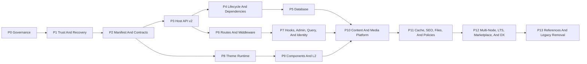

# Trusted Plugin And Theme Platform V3 - Implementation Task Book

Status: **active implementation; P0-P9 complete; P10 active (3/15)**
Date: 2026-07-13  
Decision: `knowledge/decisions/2026-07-13-trusted-plugin-theme-platform-v3.md`

## Objective

Deliver a WordPress/Typecho-class extension surface without copying their
same-process PHP implementation:

- uploaded executable plugins become fully trusted only after exact-artifact
  `super_admin` confirmation;
- plugins can add, intercept, filter, wrap, rewrite, and replace routes in v1;
- plugins can own schemas, run real migrations, and explicitly request raw core
  database authority;
- routes, hooks, pages, templates, components, assets, content, cache, services,
  jobs, commands, and plugins themselves become versioned extension surfaces;
- admin screens, queries, identity/permissions, media pipelines, navigation,
  transactional Host commands, compatibility, and distribution are first-class
  extension platform surfaces;
- themes own complete buildless public presentation through cached Go templates
  plus optional trusted prebuilt L2;
- primary content remains SSR-first and indexable without JavaScript;
- lifecycle hooks own install/upgrade/uninstall behavior;
- safe mode, CLI recovery, atomic snapshots, tracing, and multi-node convergence
  ship with full override power.

This task book defines one platform version. Phases are implementation order,
not a promise to defer route replacement, database access, component replacement,
or trusted L2 to a later product version.

## How To Use This Task Book

1. Read the decision, `AGENTS.md`, `knowledge/index.md`, and the extensions and
   frontend module notes.
2. Re-audit the live working tree and recent extension handoffs before selecting
   a phase. Several extension/frontend cleanup changes may overlap this program.
3. Execute the lowest incomplete phase unless its dependency table explicitly
   allows an independent slice.
4. Keep every commit focused and reversible. Do not combine registry foundations,
   legacy deletion, UI polish, and unrelated product changes.
5. Update this checklist, affected module notes, OpenAPI, generated extension
   catalogs, and a session handoff after every completed phase.
6. Do not claim platform completion from unit tests alone. Final gates include
   live subprocess, database, restart, browser, JavaScript-disabled, and
   multi-node/revision scenarios.
7. Monitor context usage throughout this long-running goal. Before an expected
   context compaction, update the V3 progress ledger and current session
   handoff with completed commits, dirty files, verification, decisions, next
   command, and blockers; then commit every coherent buildable slice. Never
   rely on unrecorded conversation memory to resume the program.
8. Report an overall integer progress percentage in working updates and phase
   handoffs. Use the fixed weighted phase model in the progress ledger and only
   count verified exit criteria; file count, scaffolding, and partial demos do
   not increase completion by themselves.

## Accepted Product Invariants

1. **Trust is explicit and honest.** Enabling uploaded executable code is a
   full-trust decision, not a sandbox claim.
2. **Static package install does not execute.** Upload, validation, impact
   preview, and inert storage happen before confirmation. Executable
   `install.plan`/`install` hooks are deferred to the first trusted enable.
3. **Exact artifact authority.** Trust binds to version, package digest,
   executable digests, contracts, and requested authority.
4. **All route actions are v1.** `add`, `alias`, `redirect`, `rewrite`, `before`,
   `after`, `filter`, `wrap`, `replace`, global middleware, and streaming ship
   in this program.
5. **Recovery is out of band.** Safe mode and CLI disable do not depend on the
   normal router, plugin processes, database migrations completing, or Nuxt UI.
6. **Database freedom is tiered but real.** Own-schema use is recommended; raw
   core access is available after explicit high-risk trust.
7. **Themes own public presentation.** Core owns data/policy/runtime contracts,
   not the default product layout.
8. **SSR is non-negotiable.** Search-indexable content exists in the first HTML
   response; L2 is progressive enhancement.
9. **Plugin-owned cleanup uses hooks.** Host cleanup is a safety net, not a
   replacement for plugin business/external cleanup.
10. **Registries are versioned.** Route, hook, component, template, content,
    service, database, cache, and package contracts have stable ids and versions.
11. **Conflict is visible.** Provider selection and ordered composition are
    deterministic, inspectable, and audited.
12. **No operator site build.** Themes and prebuilt extension UI activate
    without Bun/npm install, Nuxt build, Nitro restart, or runtime SFC compile.
13. **Surface density is measurable.** Every core module publishes an Extension
    Surface Matrix; closed surfaces require an explicit reason and CI detects
    undocumented coverage regressions.
14. **Plugins declare, Hosts assign.** Plugins may declare permissions and role
    suggestions but never silently grant themselves authority.

## Authoritative Baseline And Target Contract

The decision document contains the canonical 27-row template/theme comparison,
72-row plugin comparison, detailed architecture mind map, and accepted boundary
checklist. This task book must implement every row; phase summaries are not
allowed to narrow or silently omit that contract:

`knowledge/decisions/2026-07-13-trusted-plugin-theme-platform-v3.md`

P0 traceability source:
`knowledge/plans/2026-07-13-trusted-plugin-theme-platform-v3-traceability.md`.

P0 must re-audit the live implementation before work begins. Existing process
health, lifecycle separation, v1 compatibility, events/jobs, Page Registry,
Settings Document, package containment, modular OpenAPI, permissions, SSR, and
localization remain migration inputs until their explicit replacement gates pass.

## Library And Framework Choices

Use existing or mature components before inventing infrastructure:

| Problem | Primary choice | Notes |
| --- | --- | --- |
| L1 template engine | Go `html/template` | Context-aware escaping; parse once per digest |
| Static HTML inspection | `golang.org/x/net/html` + existing policy helpers | Reject unsafe static constructs at install |
| Backend plugin transport | HashiCorp go-plugin gRPC | Keep process handshake and lifecycle |
| Typed protocol | Protobuf + generated SDKs | Versioned v2 services and streaming |
| Database | PostgreSQL roles/schemas + pgx | Advisory locks, transactions, search_path |
| Host migrations | Goose primitives where compatible | Separate extension ledger and policies |
| Durable work | River | Version job payloads per extension digest |
| Shared state/invalidation | Redis | Revision propagation, cache tags, locks |
| HTML sanitization | bluemonday for user/plugin HTML boundaries | Do not sanitize full trusted template repeatedly |
| Frontend runtime | Vue/Nuxt SSR + prebuilt ESM mount API | No runtime SFC compilation |
| Contracts | JSON Schema + modular OpenAPI | Manifest, fragments, settings, render data |
| Manifest schema validation | `github.com/santhosh-tekuri/jsonschema/v6` | Draft 2020-12; Apache-2.0; embedded and executed during static preflight |

Before dependency changes, perform a short current-maintenance/license/security
check and use the repository proxy for package commands.

## Program-Wide Contract Rules

### Stable identities

- Route ids identify behavior independently from paths.
- Page ids identify view contracts independently from localized URLs.
- Component ids identify replaceable UI surfaces independently from Vue file
  names.
- Hook ids and payload versions identify ordered action/filter contracts.
- Entity, taxonomy, field, cache, provider, service, job, schedule, command, and
  asset handles are namespaced and versioned.

### Trust and permissions

- Existing delegated plugin/theme managers may inspect, upload, statically
  validate, and store inert packages without executing package code.
- `super_admin` exact-artifact confirmation is required before first execution,
  deferred install hooks, enable, executable upgrade application, migrations,
  executable frontend import, or a new high-risk authority grant.
- Delegated plugin/theme permissions remain useful for configuration, disable,
  and safe built-in operation after trust.
- Confirmation tokens are one-use, actor-bound, five-minute maximum, exact-
  artifact, and server-validated.
- Built-ins are source-trusted but still pass contract validation and tests.
- Capability displays never imply containment of already trusted code.

### Failure behavior

- Read-only GET providers may fall back only before plugin output starts.
- Unsafe route handlers fail closed; never execute core after a plugin may have
  committed a side effect.
- Registry updates are immutable snapshot swaps; partial registration is not
  visible.
- Failed migrations do not enable the new artifact.
- External uninstall failures retain the package and retry state unless the
  operator explicitly forces removal.
- L2/component failures quarantine the component and preserve SSR/L1 fallback.

### Caching

- Compiled template cache key includes package digest and compiler version.
- Shared HTML cache keys include theme revision, locale, path, normalized query,
  and the applicable anonymous/permission class.
- Authenticated or permission-sensitive output is not shared without a reviewed
  actor-safe key.
- Plugin cache namespaces and tag invalidation are enforceable in standard mode;
  raw trusted plugins may also use direct providers and own the consequences.

## Phase Dependency Map

## P0 - Rebaseline, Governance, And Contract Freeze

**Goal:** make the accepted direction authoritative before shared contracts move.

### Tasks

- [x] Re-audit the working tree after legacy Web Release removal and read its
      final handoff; reconcile response shapes, deleted services, and docs.
- [x] Mark the V3 decision and this task book as the active platform direction.
- [x] Create a 99-row traceability matrix mapping every authoritative
      current-to-target comparison row to its phase, contract, test, and rollback.
- [x] Update repository guidance that previously prohibited trusted route/API
      replacement and claimed API policy was always authoritative.
- [x] Inventory every existing route id/path/method/access/policy/handler and
      assign stable route ids and contract versions.
- [x] Inventory all public/admin UI surfaces and propose stable component ids.
- [x] Inventory hook/event/provider/job/schedule/cache/content/data surfaces.
- [x] Publish an Extension Surface Matrix per core module covering routes, hooks,
      queries, admin/public components, permissions, media, navigation/regions,
      cache invalidation, jobs, and lifecycle; document why any surface is closed.
- [x] Inventory WordPress-equivalent admin surfaces: navigation, dashboards,
      lists, columns, filters, row/bulk actions, forms, notices, editor panels,
      detail regions, importers, and exporters.
- [x] Freeze initial namespace and versioning rules.
- [x] Define feature flags/default-off gates for each new registry during
      migration; safe mode always wins over flags.
- [x] Write compatibility policy for raw core DB plugins and custom guards.
- [x] Record current performance and memory baseline for extension enable,
      route proxy, theme resolve, SSR home/topic, and plugin RPC.

### Verification

- [x] Catalog uniqueness and route/component id review.
- [x] CI fixture fails when a cataloged surface disappears, changes contract, or
      becomes closed without a reviewed decision.
- [x] The 99-row traceability matrix has no unmapped target capability.
- [x] No product behavior changes in P0.
- [x] All superseded decisions link to V3 rather than silently disagreeing.

### Rollback

- Revert documentation/catalog-only commits. No runtime state changes.

## P1 - Trust Confirmation And Out-Of-Band Recovery

**Goal:** establish the safety boundary before increasing authority.

### Tasks

- [x] Replace boolean capability confirmation with a server-issued confirmation
      challenge and one-use token.
- [x] Keep upload/static install inert and available to the existing delegated
      plugin/theme manager; do not start a process, run a lifecycle hook or
      migration, import frontend code, or contact an external system.
- [x] Canonicalize the exact impact document: binaries, routes, guards, hooks,
      migrations, DB authority, components, L2, providers, jobs, schedules,
      network, files, secrets, and dependencies.
- [x] Bind confirmation and durable trust to every relevant digest/version.
- [x] Add admin impact preview with persistent errors and 10-second success
      feedback following project toast rules.
- [x] Preserve L0/L1 or Schema fallback when executable frontend trust is absent.
- [x] Invalidate trust on artifact, contract, authority, or dependency change.
- [x] Implement `SFORUM_SAFE_MODE=1` before third-party sync/start.
- [x] Add CLI commands to list, disable one, and disable all third-party
      extensions without starting plugin code or the HTTP server.
- [x] Persist last activation attempt and automatically skip a newly crashing
      extension according to a reviewed boot-loop policy.
- [x] Add audit events for challenge, grant, revoke, deny, safe-mode boot, and
      CLI recovery.

### Tests

- [x] Wrong actor, expired, replayed, stale digest, changed route/migration/L2,
      and missing challenge are denied.
- [x] Same digest restart does not require confirmation.
- [x] Upload/static install by a delegated manager produces the complete impact
      preview while proving that no package code or migration executed.
- [x] Safe mode starts with broken routes/components/plugins installed.
- [x] CLI disable works with API/Nuxt stopped and plugin packages malformed.
- [x] Denied and allowed paths cover `super_admin` policy at service and HTTP
      levels.

### Rollback

- Feature flag keeps new executable grants disabled while retaining existing
  v1 plugin behavior. Safe-mode code is additive and must remain usable.

## P2 - Manifest V3, Package Graph, And Contract Schemas

**Goal:** describe the complete platform before runtime implementation.

### Tasks

- [x] Version the extension manifest and add sharded declarations for routes,
      guards, hooks, components, templates, assets, content, database, cache,
      services, commands, admin surfaces, queries, identity, permissions, media,
      navigation/regions, dependencies, lifecycle, and OpenAPI fragments.
- [x] Define required/optional/conflict/provides dependency semantics and
      deterministic activation order.
- [x] Define route actions, method/streaming modes, stable target ids, guards,
      priority, fallback, request/response schemas, and contract versions.
- [x] Define arbitrary declared public/admin/API paths and HTTP methods; reserve
      only out-of-band safe-mode/CLI recovery outside the Route Registry.
- [x] Define component actions, target ids, SSR fragment, L2 component, prop/
      result contracts, and theme override keys.
- [x] Define Admin Surface declarations for navigation, dashboards, list
      columns/filters, row/bulk actions, forms, notices, editor panels, detail
      regions, importers, and exporters.
- [x] Define Query declarations for entity, plan/version, fields, relations,
      filters, sort, pagination, result schema, permission policy, and cache tags.
- [x] Define Identity/Permission declarations for capabilities, recommended role
      mappings, user fields, auth/profile/recovery providers, sessions, risk
      hooks, and assignment policy; plugin declarations never self-grant.
- [x] Define Media Pipeline and Navigation/Region declarations including MIME,
      transforms/variants and theme-defined menu/widget regions.
- [x] Define database authority, migration metadata, schema ownership, backup,
      retention, and raw core compatibility ranges.
- [x] Define cache namespaces, policies, tags, providers, and invalidators.
- [x] Define lifecycle plan/execute hooks and progress/checkpoint schemas.
- [x] Define package-local asset, locale, template, and executable entry rules.
- [x] Add JSON Schema and modular OpenAPI definitions.
- [x] Update CLI scaffold/validate/test and generated catalog docs.
- [x] Preserve old manifest normalization where behavior is unambiguous; reject
      unsafe implicit upgrades.

### Tests

- [x] Schema fixtures for minimal theme, safe plugin, trusted application plugin,
      raw DB plugin, full route plugin, L2 plugin, admin/query/identity/media/
      navigation plugins, and plugin dependency graph.
- [x] Invalid paths, duplicate ids, cycles, missing contracts, ambiguous replace
      providers, unknown guards, and digest omissions fail preflight.
- [x] OpenAPI reference validation and catalog drift checks pass.

### Rollback

- Manifest version gate rejects V3 packages while V1/V2 packages remain usable.

## P3 - Host API V2 And Generated SDKs

**Goal:** replace untyped RPC as the long-term extension protocol.

### Tasks

- [x] Define Protobuf packages for handshake, health, lifecycle, Host queries/
      commands, routes, hooks, DB, cache, jobs, schedules, services, secrets,
      files, HTTP, admin surfaces, identity, permissions, media, navigation,
      audit, and tracing.
- [x] Define versioned transactional Host Commands for common multi-module
      writes with authoritative policy checks, idempotency, dry-run/impact data,
      atomic commit, audit, and typed results.
- [x] Add HashiCorp go-plugin gRPC protocol v2 negotiation.
- [x] Keep a v1 net/rpc compatibility adapter and explicit deprecation metrics.
- [x] Generate Go SDK first; document how non-Go SDKs preserve handshake and
      trust requirements.
- [x] Carry actor, locale, trace id, request id, deadline, extension identity,
      and granted authority in typed envelopes.
- [x] Support server/client streaming where routes, files, progress, or jobs
      require it.
- [x] Add bounded message sizes, timeouts, cancellation, concurrency limits,
      health, readiness, and protocol mismatch errors.
- [x] Add service discovery so plugins expose versioned services to other
      plugins through the host broker.
- [x] Migrate one built-in reference plugin without removing v1 support.

### Tests

- [x] Protocol compatibility matrix, cancellation, deadline, oversized message,
      crash, restart, stale token, service discovery, streaming, and
      transactional Host Command rollback tests.
- [x] Existing v1 SMTP/storage/content-policy fixtures remain green.
- [x] Generated SDK and documentation drift checks run in CI.

### Rollback

- Per-plugin protocol selection returns the migrated plugin to v1. Do not delete
  v1 until P13 exit gates pass.

## P4 - Lifecycle V2, Dependency Graph, And Authoritative Hooks

**Goal:** make package behavior inspectable and recoverable across its life.

### Tasks

- [x] Implement `install.plan`, `install`, `enable`, `disable`, `upgrade.plan`,
      `upgrade.before`, `upgrade.after`, `rollback`, `uninstall.plan`,
      `uninstall`, and `uninstall.after` contracts.
- [x] Defer executable `install.plan` and `install` to the first trusted enable
      transaction; static package installation must never invoke them.
- [x] Resolve dependency graph and conflicts before code/migrations execute.
- [x] Add lifecycle state machine with planned, migrating, starting, healthy,
      registering, enabled, draining, uninstalling, failed, and recovery states.
- [x] Require idempotency keys, stable step ids, checkpoints, progress, and
      resumable failure behavior.
- [x] Run uninstall hooks while package/runtime and last approved authority are
      still available.
- [x] Support preserve data, export then remove, and complete removal modes.
- [x] Make plugin hooks primary for business/core/external cleanup and Host
      cleanup primary for registrations/tokens/managed namespaces.
- [x] Add retry, skip-step, and forced uninstall UI with accurate residual-risk
      text.
- [x] Drain routes/jobs/schedules before disable/upgrade/uninstall.
- [x] Version queued job payloads and define drain/migrate/cancel behavior.

### Tests

- [x] Crash/retry at every lifecycle boundary.
- [x] Dependency cycle, missing version, optional dependency, conflict, and
      provides resolution.
- [x] Idempotent repeated uninstall, external cleanup failure, forced removal,
      data preserve/export/delete, and audit coverage.
- [x] Old-version queued jobs cannot execute against incompatible new code.

### Rollback

- V1 lifecycle remains selectable for old packages. New authority requires V2
  lifecycle and cannot silently downgrade after migrations begin.

## P5 - Plugin Database Registry And Real Migrations

**Goal:** give plugins durable application data and explicit raw escape hatches.

### Tasks

- [x] Create deterministic safe PostgreSQL role/schema names per extension.
- [x] Provision/revoke credentials and `search_path` for plugin processes.
- [x] Implement real migration discovery, checksum, advisory lock, dry-run,
      transaction policy, execution ledger, progress, and failure state.
- [x] Reuse Goose primitives where appropriate without mixing core and plugin
      migration histories.
- [x] Support plugin-owned transactions through v2 DB service or direct scoped
      connection.
- [x] Publish stable read-only core views and typed Host Query/Command APIs.
- [x] Implement the first transactional Host Commands for user/content/meta,
      moderation, entitlement, and attachment workflows so raw core DB access is
      an escape hatch rather than the normal integration path.
- [x] Implement exact-artifact `database.core.full` grants for raw core access.
- [x] Block incompatible core upgrades using declared schema compatibility.
- [x] Add backup/export guidance before destructive migrations.
- [x] Integrate uninstall plan and Host fallback cleanup for schemas, roles, and
      credentials.
- [x] Add DB query tracing, slow-query limits, and per-plugin connection budgets.

### Frozen Product Boundary

The operator approved all recommended P5 defaults on 2026-07-15:

- replace the mutually exclusive V3 model with additive database grants while
  retaining `database.authority` as a cumulative compatibility input;
- issue one lease role/credential per exact runtime and keep source and target
  leases valid together until the source runtime drains;
- use short-lived Host-signed, actor-bound delegation only for actor-scoped Host
  Commands initiated by a core route/admin invocation; background calls remain
  explicit actorless service authority;
- implement the provider-neutral entitlement minimum as subject, resource or
  capability, lifecycle state, source, validity, idempotency, and audit without
  embedding billing or provider behavior.

### Tests

- [x] Concurrent migration, checksum drift, lock recovery, transaction rollback,
      non-transactional DDL warning, credential revoke, and uninstall retention.
- [x] Own-schema plugin cannot access core without authority.
- [x] Raw-authority plugin can perform the disclosed operations and causes the
      expected compatibility warning/block.
- [x] Transactional Host Command commits all declared steps or rolls all of them
      back after policy, validation, idempotency, or storage failure.
- [x] Multi-process/multi-node migration-once tests.

### Rollback

- Disable new DB grants, revoke credentials, and retain schemas. Never drop
  plugin data as an automated rollback.

P5 closed at **17/17** on 2026-07-16. The approved additive Manifest V3 name
for the high-risk `database.core.full` capability is `raw_core`; exact runtime
lease identity, physical PostgreSQL ACLs, trust disclosure, and compatibility
blocking implement the authoritative row without retaining a second alias.

## P6 - Full Route And Middleware Registry V1

**Goal:** ship every accepted route action in this platform version.

### Tasks

- [x] Inventory/register stable ids and versions for every core route.
- [x] Implement immutable route snapshots and deterministic specificity/priority.
- [x] Remove the `/extensions/{id}/*` target restriction and support any declared
      public, admin, or API path and HTTP method by stable route id.
- [x] Implement `add`, `alias`, `redirect`, `rewrite`, `before`, `after`,
      `filter`, `wrap`, `replace`, and global middleware.
- [x] Support HTTP request/response, multipart upload, streaming, SSE, WebSocket,
      cancellation, and backpressure through the proxy/runtime.
- [x] Default to inherited core guards; implement separately confirmed custom
      guard/raw request authority.
- [x] Validate request/response/filter schemas and explicit mutable fields.
- [x] Add explicit provider selection and conflict UI for replace providers.
- [x] Define safe GET fallback and fail-closed unsafe method behavior.
- [x] Prevent fallback after headers/body/plugin side effects begin.
- [x] Add route aliases/redirect SEO status/canonical integration.
- [x] Add modular plugin OpenAPI fragments, validation, aggregation, permissions,
      rate-limit, idempotency, and generated-client metadata.
- [x] Add Route Inspector with chain, provider, guard, timing, fallback, and
      contract details.

### Tests

- [x] Every route action, priority order, conflict, locale path, query/body,
      permission, CSRF, custom guard, stream, disconnect, timeout, and crash.
- [x] Unsafe replacement failure never executes core as a second writer.
- [x] Safe mode bypasses all third-party route snapshots.
- [x] OpenAPI aggregation rejects collisions and unsafe references.
- [x] Performance comparison against current namespaced proxy baseline.

### Rollback

- Atomic route snapshot returns to the previous revision. Existing namespaced
  plugin proxy remains available until P13.

P6 closed at **18/18** on 2026-07-18. Non-HTTP route bodies retain the accepted
opaque `DataChunk` contract rather than an invented JSON framing layer. The
named Routes/HTTP/PostgreSQL gates join real generic binary streaming, bounded
TCP slow-consumer backpressure, exact cancellation and terminal ownership,
zero-incident caller/Host paths, four durable incident classes, custom/raw
authority, every route action, and the complete behavior matrix.

## P7 - Hooks, Services, Work, Admin Surfaces, Queries, And Identity

**Goal:** let plugins create reusable services and extend everyday operator,
query, and identity workflows without replacing whole routes.

### Tasks

- [x] Implement versioned namespaced action/filter hook registration.
- [x] Support priority, typed payload/result schemas, failure policy, sync/async,
      and deterministic composition.
- [x] Preserve core validate/filter revalidation where a core handler remains
      authoritative; trusted replacements own their declared behavior.
- [x] Add plugin-defined provider slots and host-brokered service discovery.
- [x] Add typed plugin-to-plugin service calls with dependency/version checks.
- [x] Generalize provider selection/reset/probe/health/fallback UI.
- [x] Add dynamic typed jobs, schedules, concurrency policies, retries, and
      versioned payloads.
- [x] Add Plugin Command Registry to the `sforum` CLI with namespace/conflict
      rules and trust checks.
- [x] Implement Admin Surface Registry for navigation, dashboards, lists,
      columns, filters, row/bulk actions, forms, notices, editor panels, detail
      regions, importers, and exporters with typed props/results.
- [x] Implement Query Registry with typed query plans, fields, relations,
      filters, sorting, pagination, result filters, permission rechecks, cache
      tags, query cost limits, and deterministic composition.
- [x] Implement Identity/Permission Registry for capability declarations, role
      suggestions, user fields, session/risk hooks, audit, and permission-aware
      component/query contracts.
- [x] Implement Auth/Profile Provider surfaces for registration, login, account
      recovery, profile sections, account management, and external identity
      linking without exposing raw session cookies as authority by default.
- [x] Keep permission assignment Host-owned: install/enable previews declared
      capabilities but never grants them silently; admins approve role mappings.
- [x] Add extension read/call/manage authority for trusted automation plugins.
- [x] Generate hook/service/provider/job/schedule/command docs and SDK clients.

### Tests

- [x] Plugin A defines a hook/service/provider; Plugin B consumes it.
- [x] Reference admin plugin contributes navigation, dashboard, list column,
      filter, row/bulk action, editor panel, notice, importer, and exporter.
- [x] Query plugins compose filters/sorts without bypassing permission checks,
      exceeding cost limits, corrupting pagination, or poisoning cache keys.
- [x] Identity plugin adds auth/profile/user fields and permissions while denied
      actors remain denied and no role receives an implicit grant.
- [x] Priority, timeout, failure policy, version mismatch, dependency disable,
      cycle, and provider fallback.
- [x] CLI command is unavailable in safe mode unless explicitly recovery-safe.
- [x] Job/schedule disable and upgrade drain behavior.

The six-family SDK/catalog row closed in `e92016366`. Callable hook, service,
provider, job, and command families expose typed registries or clients with
source-derived validation limits. Plugin schedules remain a Host-owned Manifest
declaration surface: the generated wire client is documented as unregistered,
and the SDK does not invent a List/Trigger helper that production cannot serve.

### Rollback

- Registry revision removes plugin-defined service/admin/query/identity surfaces
  atomically. Consumers become blocked or use declared optional fallback without
  stale calls; Host role assignments are preserved or explicitly cleaned by the
  lifecycle plan.

## P8 - Complete Theme Compiler, Page ViewModels, And Runtime Snapshots

**Goal:** move public presentation out of core without harming SSR or performance.

### Tasks

- [x] Define versioned Page ViewModels for every catalog page, including actor/
      permission state, route params, pagination, SEO, structured data, and
      safe rich-content fields, navigation trees, breadcrumbs, and region data.
- [x] Implement Theme Compiler around `html/template` with restricted FuncMap,
      layouts, blocks, partials, asset/route/i18n helpers, missing-key policy,
      bounded execution, output limits, and recursion checks.
- [x] Explicitly support standard `if`, `range`, `with`, `template`, and `block`
      actions without exposing unreviewed Host functions.
- [x] Inspect/reject unsafe static template constructs at install; rely on
      contextual escaping for dynamic values.
- [x] Introduce explicit core-produced SafeHTML values for already-sanitized
      rich content; themes cannot create arbitrary SafeHTML.
- [x] Build immutable digest/compiler-version `ThemeRuntimeSnapshot` containing
      provider bindings, compiled templates, assets, locales, and contracts.
- [x] Remove request-time theme/provider DB lookup, template file read, parsing,
      repeated full-template sanitization, and regex island parsing.
- [x] Return safe HTML segments, typed island descriptors, and SEO payloads.
- [x] Implement fallback order: active theme plugin override, plugin template,
      active/default theme template, minimal core emergency output.
- [x] Keep theme overrides presentation-only: they consume versioned plugin data
      contracts and cannot alter plugin business data semantics.
- [x] Fix exactly-one active theme, restart restore, stale binding cleanup,
      preview-bound activation, cache revision, and multi-node convergence.
- [x] Keep admin styling outside public theme assets.

### Tests

- [x] Compile/execute performance and memory benchmark for small/large templates.
- [x] XSS, URL context, missing values, recursion, excessive output, unsafe
      helper, invalid partial, digest change, and fallback.
- [x] Theme switch survives API/Nitro restart and concurrent activation.
- [x] `curl` with Baiduspider and JavaScript-disabled browser receives title,
      content, links, pagination, canonical, robots, hreflang, and JSON-LD.
- [x] With JavaScript disabled, body, lists, comments, and pagination remain
      complete across the home, list, topic, profile, and plugin-page catalog.
- [x] No theme disk I/O or provider DB query on the hot request path.

The Page ViewModel row closed on 2026-07-16 after all 23 catalog contracts used
real product projections and the isolated production API/Nitro matrix proved
SSR, restart, concurrent activation, and JavaScript-disabled output. Schema
presence alone was not credited before that production evidence passed.

Exact plugin business-contract preservation was accepted in `cd1573d5a`.
Lifecycle publication freezes one digest-bound plugin DTO/schema, theme
overrides receive only that sealed value, and invalid or mismatched output
falls back without changing plugin business or numeric semantics.

### Rollback

- Snapshot selects current core provider while old Page Registry/L1 remains
  behind a migration flag. Do not delete core presentation until P13.

## P9 - Component, Template Override, Asset, And Trusted L2 Runtime

**Goal:** let plugins and themes compose the complete public/admin view layer.

### Tasks

- [x] Define stable component ids for public and admin surfaces.
- [x] Implement Navigation/Region Registry for menus, breadcrumbs, headers,
      footers, sidebars, theme-defined widget regions, ordering, visibility,
      permission filtering, fallback, and cache invalidation.
- [x] Implement component `add`, `before`, `after`, `wrap`, `replace`, `hide`,
      prop filters, and result filters with deterministic priority/providers.
- [x] Implement plugin SSR template fragments and typed render segments.
- [x] Implement theme overrides under `templates/plugins/{pluginId}` with
      contract and digest checks.
- [x] Reject theme overrides that declare or infer a different plugin business
      data contract.
- [x] Build Asset Registry for handles, dependencies, versions, modules,
      loading strategy, integrity, CSP, scope, deduplication, and cleanup.
- [x] Implement package-local prebuilt public L2 ESM/CSS mount/unmount contract.
- [x] Reuse exact-digest confirmation, immutable asset delivery, error boundary,
      cleanup, quarantine, and SSR/L1 fallback principles from admin components.
- [x] Allow trusted component code to run with current browser authority and
      state that honestly in UI/docs.
- [x] Keep primary SEO content in L1/SSR fragments or SSR host islands.
- [x] Add Component/Template/Asset inspectors and conflict UI.

### Tests

- [x] Every component action, priority/conflict/provider selection, theme plugin
      override, SSR fallback, hydration, mount/unmount, CSS cleanup, L2 crash,
      digest upgrade, trust revoke, and safe mode.
- [x] Navigation and region contributions remain deterministic, permission-safe,
      SSR-complete, cache-correct, and usable when a provider is disabled.
- [x] Desktop/mobile visual and interaction checks for replaced high-traffic
      components.
- [x] L2 failure never removes primary content or breaks unrelated navigation.

The Asset Registry and exact frontend-safety rows closed through
`d8d6d5205`, `55063b1a3`, `cf5636927`, `44cfb67dc`, and `f5ed19d2c`, with the
production upload/mount/restart/revoke proof retained in `86d112ef5`. One shared
immutable Registry now owns bounded declarations, dependency plans, exact
artifact/revision fences, lifecycle cleanup, restart/Safe Mode restore, and
request-path delivery. Page-scoped CSP aggregation into Nuxt SSR headers is
production-wired via `GET /api/v1/extensions/runtime/page-policy` and
`SFThemeTemplate` (`8aa675626`); public L2 remains production-default off
(`SFORUM_V3_PUBLIC_L2`) until operators opt in. Joined production matrix rows:
`TestP9JoinedComponentActionMatrix`, `TestP9JoinedPublicL2TrustMatrix`, and
`p9JoinedVisualMatrix.test.ts`.

### Rollback

- Revoke component/L2 grant and atomically restore prior/core providers. Schema
  settings and L1 fallback remain usable.

## P10 - Content, Editor, Entity, Taxonomy, Media, And Render Pipelines

**Goal:** let plugins introduce new product content, not only decorate pages.

### Tasks

- [x] Implement Block, Shortcode, Embed Provider, and Content Type registries.
- [ ] Implement Tiptap node/mark/command/toolbar declaration and prebuilt editor
      extension loading under trusted L2.
- [x] Implement Media Pipeline Registry for MIME policy, upload validation,
      malware/security scanning providers, metadata extraction, transforms,
      variants, CDN URLs, background processing, retention, and deletion hooks.
- [x] Preserve an immutable original or explicitly declared source-of-truth asset
      so disabling a transform plugin never destroys user media.
- [ ] Define paired editor JSON schema, storage version, server renderer, plain
      text/excerpt extraction, sanitizer, search extraction, and migration.
- [ ] Implement ordered parse/validate/normalize/store/render/sanitize/embed/SEO
      pipeline contracts.
- [ ] Add Entity Type, Taxonomy, Field Schema, field UI, validation, indexing,
      permission, import/export, and deletion contracts.
- [ ] Allow plugins to extend plugin-defined content/entity types through
      versioned dependencies and hooks.
- [ ] Preserve authoritative attachment read/write policy and rich-content XSS
      boundaries.

### Tests

- [ ] Reference blocks for vote, product/card, embed, and workflow form.
- [ ] Reference media plugin proves custom MIME policy, metadata, image/video
      variants, background processing, CDN URL selection, and cleanup.
- [ ] Traversal, MIME confusion, decompression bomb, transform crash/retry,
      duplicate jobs, orphan variants, provider disable, and uninstall retention.
- [ ] Round-trip editor/storage/server render/client render/plain text/search.
- [ ] Schema upgrade, unsupported block fallback, sanitizer attack corpus,
      disabled plugin content rendering, and theme override.
- [ ] Entity/taxonomy/field permissions and index/query behavior.

### Rollback

- Unknown/disabled content renders stable fallback preserving source data. Media
  falls back to its original/source-of-truth asset. Never delete or rewrite user
  content merely because a plugin is disabled.

The Content Registry production lifecycle row closed by wiring immutable
`Support/ContentRegistry` into Host lifecycle publication plan `@8`
(`content.v1`): freeze/validate/reconcile/restore, Safe Mode core-only,
bootstrap process-local registry, and upgrade/rollback/disable CAS tests.
Manifest kinds remain `block`/`shortcode`/`embed`/`node`/`mark`/
`render_filter`/`sanitizer`.

The Media Pipeline Registry production lifecycle row closed by wiring immutable
`Support/MediaRegistry` into Host lifecycle publication plan `@9` (`media.v1`):
Manifest `media` freezes to MIME policy + transform processor + exact-package
variants (processor owner/digest bound so disable cannot rewrite originals),
Safe Mode core-only restore, bootstrap process-local registry, and
upgrade/rollback/disable CAS tests. Editor JSON/Tiptap L2, entity/taxonomy,
and reference media plugin product proofs remain open.

## P11 - Cache, SEO, Secrets, Files, HTTP, Localization, And API Policies

**Goal:** complete the operational surfaces needed by real product plugins.

### Tasks

- [x] Implement namespaced cache get/set/delete/increment/remember/tags/locks.
- [ ] Implement cache provider selection plus route/page key, TTL, bypass,
      no-store, invalidation, and entity-event filters.
- [ ] Add cache inspector, hit/miss/latency metrics, tag invalidation audit, and
      theme/plugin revision awareness.
- [ ] Add SEO Registry for controlled title/meta/canonical/robots/hreflang/
      sitemap/JSON-LD contributions and filters.
- [ ] Implement namespaced Secret Store with encryption, masking, preserve-on-
      empty, rotation, references, and audit.
- [ ] Implement plugin private files, temporary files, static assets, user-owned
      files, quotas, cleanup, and optional storage-provider routing.
- [ ] Implement Host HTTP client with proxy, timeout, retry, SSRF policy,
      credential references, response limits, and tracing; preserve explicit raw
      network authority for fully trusted processes.
- [ ] Add runtime translation domains, pluralization, locale fallback, plugin
      language packs, and controlled overrides.
- [ ] Add versioned Settings lifecycle: schema migrations, default/reset policy,
      import/export, conditional fields, validation previews, and Secret Store
      references without exposing plaintext secrets.
- [ ] Complete plugin OpenAPI route policies for rate limits, idempotency,
      permissions, request size, CORS, and generated clients.

### Tests

- [ ] Cache stampede/lock/tag/provider failure, stale theme revision, actor-safe
      output, and invalidation.
- [ ] SEO source checks with JS disabled and plugin disabled/failing.
- [ ] Secret disclosure, rotation, logs, backups, and uninstall behavior.
- [ ] File traversal/symlink/quota/read policy and HTTP SSRF/redirect/DNS rebinding.
- [ ] Locale fallback and catalog collision.
- [ ] Settings upgrade/downgrade, failed migration rollback, reset defaults,
      import validation, export masking, conditional fields, and secret rotation.

### Rollback

- Restore core cache/SEO/file/HTTP providers and preserve plugin namespaces for
  later retry or uninstall plan.

The first Cache task closed in `ba4ebc50c`. The production Host service and
Protocol V2 broker already own exact-runtime namespaces, providers, tags,
distributed leases, inspection, and failure fencing; the Go SDK now exposes
typed CRUD, CAS revisions, bounded cross-process `remember`, lease renewal, and
atomic set-and-release without leaking opaque lease capabilities. Provider
policy, inspector, and failure-matrix work remains tracked by the following
Cache task and test rows rather than being counted twice here.

## P12 - Multi-Node, Compatibility, Marketplace, Observability, And DX

**Goal:** make the powerful platform operable and supportable.

### Tasks

- [x] Persist desired/active extension and theme revisions with per-node
      acknowledgement and startup reconciliation.
- [ ] Ensure migrations execute once before rolling runtime activation.
- [ ] Add staged/canary activation, health gate, drain, atomic snapshot switch,
      rollback, and old artifact retention.
- [ ] Add package update channels, digest/signature/provenance/SBOM metadata,
      vulnerability/revocation notices, compatibility preflight, and rollback.
- [ ] Publish Host/Frontend API LTS windows, minimum deprecation periods,
      compatibility shims, removal criteria, and usage/deprecation telemetry.
- [ ] Build an automated compatibility test farm across supported SForum,
      protocol, manifest, database, browser, and dependency versions.
- [ ] Add a signed marketplace index with dependency resolution, compatibility
      reports, security notices, provenance/SBOM display, staged updates,
      operator policy, direct-upload fallback, and one-click rollback.
- [ ] Add an optional operator-managed system extension tier for early auth,
      cache, storage, and infrastructure providers; Safe Mode always bypasses it
      and CLI recovery can disable it without loading extension code.
- [ ] Add Route, Hook, Component, Template, Content, SQL, Cache, RPC, Job, and
      Dependency inspectors.
- [ ] Attribute latency, errors, queries, cache, memory, goroutines/processes,
      and fallbacks to extensions.
- [ ] Add local developer Host, fixtures, protocol simulator, impact preview,
      hot reload, package builder, contract tests, and compatibility matrix.
- [ ] Add one-command create/run/test/package workflows plus Extension Surface,
      Hook, Query, Admin Surface, Identity, Media, and Navigation explorers with
      generated recipes and typed SDK examples.
- [ ] Add privacy export/erase hooks, data inventory, retention, backup, and
      uninstall evidence.
- [ ] Document support boundaries for raw core DB/custom guard plugins.

### Tests

- [ ] Multi-node enable/upgrade/rollback/restart with missed Redis notifications.
- [ ] Old node/new node contract mismatch and migration failure.
- [ ] Signed/unsigned/revoked/update rollback flows.
- [ ] Marketplace dependency, incompatible version, withdrawn release, stale
      index, offline direct-upload, staged update, and rollback flows.
- [ ] LTS compatibility farm runs current and deprecated fixtures; telemetry
      identifies shim use before any supported contract is removed.
- [x] Broken system extension cannot prevent Safe Mode or out-of-band CLI boot.
- [ ] Inspector accuracy and overhead benchmark.
- [ ] Privacy export/delete and retained external-resource warning.

### Rollback

- Desired revision points back to prior immutable artifacts. Marketplace can be
  disabled while signed/direct upload remains available. LTS shims remain
  additive until published removal gates pass. Database rollback is never
  assumed; migration compatibility/backup policy governs it.

## P13 - Reference Themes And Plugins, Migration, And Legacy Removal

**Goal:** prove the platform end to end before deleting compatibility paths.

### Reference packages

- [ ] Complete default theme: every public page, layout, partial, plugin-template
      fallback, SEO, responsive state, and settings.
- [ ] Nocturne or another contrasting theme: full page coverage and plugin
      template overrides, not only L0/home chrome.
- [ ] SEO reference plugin proving SEO Registry, title/meta/canonical/robots,
      sitemap/JSON-LD, route integration, query/cache invalidation, admin list/
      bulk tools, theme components, JavaScript-disabled output, and uninstall.
- [ ] Identity/membership reference plugin proving auth/profile/recovery
      providers, user fields, capabilities, role suggestions, session/risk hooks,
      admin surfaces, audit, privacy export/erase, and no implicit permission grant.
- [ ] Custom-content reference plugin proving Entity/Taxonomy/Field/Query
      registries, editor blocks, shortcodes/embeds, server fallback rendering,
      templates, navigation regions, import/export, search, and schema migration.
- [ ] Media optimization reference plugin proving MIME policy, scanning,
      metadata, transforms/variants, storage/CDN selection, background jobs,
      original fallback, admin bulk tools, retention, and uninstall cleanup.
- [ ] Trusted commerce/workflow reference plugin proving:
      - own schema and real migrations;
      - typed Host queries/commands and disclosed raw core DB use;
      - add/alias/redirect/rewrite/before/after/filter/wrap/replace routes;
      - custom guard and streaming route;
      - page/template/component add/wrap/replace;
      - L2 public/admin UI and asset dependencies;
      - blocks/editor/render pipeline and custom entity/taxonomy/fields;
      - cache policy/provider/invalidation;
      - jobs, schedules, CLI, services, hooks, providers, and OpenAPI;
      - another plugin extending its hooks/components/services;
      - install/upgrade/rollback/uninstall plan and external cleanup simulation.
- [ ] Each reference plugin is independently installable and useful; no plugin
      may rely on showcase-only Host shortcuts or require a core product edit.

### Migration and deletion

- [ ] Migrate built-in/reference v1 plugins to v2 while keeping compatibility
      fixtures for the published Host/Frontend API LTS window.
- [ ] Move default public presentation out of core Nuxt pages/layouts/CSS.
- [ ] Remove request-time template loader/regex renderer and legacy Page Outlet
      behavior after parity gates.
- [ ] Remove v1 route/capability/migration-ledger-only paths only after published
      compatibility policy and migration tooling exist.
- [ ] Regenerate all catalogs/docs/scaffolds and update examples.

### Final gates

- [ ] `cd apps/api && go test ./...`
- [ ] `cd apps/api && go build ./...`
- [ ] `ruby scripts/validate-openapi-refs.rb`
- [ ] `cd apps/web && bun run typecheck`
- [ ] `cd apps/web && bun run build`
- [ ] `./scripts/test.sh`
- [ ] Live API, worker, Redis, PostgreSQL, Meilisearch, Mailpit, and plugin
      subprocess integration.
- [ ] Restart, safe mode, CLI recovery, multi-node revision, migration, upgrade,
      rollback, uninstall, forced uninstall, and retained-data scenarios.
- [ ] Browser desktop/mobile, JavaScript disabled, Baiduspider source, hydration,
      component replacement, L2 failure, and theme switch evidence.
- [ ] Five-reference-plugin matrix proves every Extension Surface Matrix family
      and all 99 authoritative current-to-target rows without core product edits.
- [ ] Performance/memory regression report against P0 baseline.
- [ ] Security review for custom guards, raw DB, route replacement, L2, files,
      secrets, HTTP, OpenAPI, and plugin-to-plugin authority.

## Post-V3 Deferred Follow-up - API Memory And Runtime Hygiene

This is a **non-blocking post-program backlog**, not a V3 phase. It has no P
number, task-row credit, or phase weight and must not change the fixed progress
calculation, the 99-row target, P13 Final Gates, or Program Definition of Done.
Do not start implementation while any V3 phase or final gate remains incomplete.

### Evidence recorded on 2026-07-18

- The admin overview's primary `memoryBytes` value is Go `runtime.MemStats.Sys`,
  not process RSS, private physical footprint, container working set, or live
  heap. The UI already carries `heapAllocBytes` separately, so the primary label
  can overstate actionable memory use.
- The running development API fluctuated around 156-181 MiB RSS. macOS `vmmap`
  reported about 92-112 MiB private physical footprint and a 164 MiB peak. This
  short observation is insufficient to establish a heap leak.
- The API owned four active backend plugin children using about 58 MiB combined
  RSS. Separately, 169 reparented plugin processes (`PPID=1`), mostly old
  `sforum.storage-fs` artifacts, used about 1.18 GiB combined RSS. These were
  observed only and were not terminated during the investigation.
- Development embeds River in the API by default. The six configured queue
  defaults total 30 worker slots, while production defaults to a standalone
  worker.
- The current loopback API returned 404 for `/debug/pprof/heap`; there is no
  enabled heap profile with which to attribute retained allocations.
- The development binary was about 75 MiB without stripped debug metadata. The
  production Docker build also omits `-trimpath -ldflags="-s -w"`; stripping is
  build/image hygiene and must not be presented as a material runtime-memory fix.
- Core still links provider-specific OSS, COS, FTP, and SFTP implementations.
  Moving vendor behavior behind existing plugin/provider contracts remains the
  architecture-aligned way to remove those dependencies from the Host.

### Deferred execution order

1. Correct observability semantics: distinguish Go `Sys`, `HeapAlloc`,
   `HeapSys`, process RSS/private working set, container/cgroup memory, and the
   aggregate API-plus-plugin process family. Establish an idle and representative
   load baseline before setting a numeric target.
2. Add default-off, loopback-only profiling with explicit production security
   controls. Capture heap, allocation, goroutine, and representative load
   profiles before claiming a leak or selecting optimizations.
3. Close plugin child-process containment: cover graceful stop, Host crash,
   forced test termination, startup reconciliation, exact-artifact ownership,
   and Linux parent-death/process-group behavior. Add a bounded orphan detector
   and normal/race/integration evidence without killing unrelated processes.
4. Define explicit development and small-VPS River concurrency profiles. Compare
   embedded and standalone workers using both API-process and whole-family
   memory, rather than moving memory to another process and calling it saved.
5. Load-test a deployment-aware `GOMEMLIMIT` policy with latency, GC CPU, queue
   throughput, and OOM evidence. Do not choose a limit from `MemStats.Sys` alone.
6. Move remaining vendor storage implementations out of Core through the
   existing provider/plugin contracts, preserving safe defaults, migrations,
   operator reset behavior, and compatibility policy.
7. Repeat the P0/P13 performance and memory regression report after each accepted
   change. Keep binary stripping results separate from runtime working-set gains.

### Rust decision gate

- Do not rewrite or split the main Go API solely to reduce the current memory
  number. A second runtime can duplicate pools, telemetry, deployment, contracts,
  and authorization while leaving the measured Go Host baseline in place.
- Consider Rust first for an independently bounded CPU/memory-heavy worker, or
  for plugin subprocesses where replacing several resident Go processes produces
  a measured whole-family saving.
- A Rust plugin experiment must first prove compatibility with the exact Protocol
  V2 handshake, gRPC/AutoMTLS, Host broker, trust/admission, lifecycle drain, and
  generated contract tests. Protobuf generation alone is not compatibility.
- Adopt a Rust component only after a same-workload comparison covers RSS/private
  working set, peak memory, throughput, latency, build/release complexity,
  observability, failure isolation, and maintenance ownership.

Detailed historical context remains in
`knowledge/plans/2026-07-12-api-memory-runtime-hygiene.md`. This post-V3 backlog
supersedes that document's cancelled P1/P2 only after the V3 completion gate
above opens; it does not silently reactivate them during V3.

## Permission Matrix Target

| Operation | Minimum authority |
| --- | --- |
| Inspect installed extension metadata | `extension.view` |
| Upload/store/static-preflight an inert plugin package | existing plugin manage permission |
| Upload/store/static-preflight an inert theme package | existing theme manage permission |
| Configure declared safe settings | existing plugin/theme manage permission |
| Disable uploaded executable plugin | plugin manage or stronger existing policy |
| First execution/enable or executable upgrade application | active `super_admin` + exact confirmation |
| Run deferred executable install/upgrade lifecycle hooks | active `super_admin` + exact confirmation |
| Run plugin migrations | active `super_admin` + exact confirmation |
| Grant custom route guard/raw request | active `super_admin` + high-risk confirmation |
| Grant raw core database authority | active `super_admin` + high-risk confirmation |
| Grant public/admin executable frontend | active `super_admin` + exact frontend digest |
| Approve plugin permission-to-role mappings | existing role/permission management authority; never plugin code |
| Activate ordinary L0/L1 theme | theme manage permission; exact preview |
| Enable/update a system-tier extension | active `super_admin` + exact confirmation and host-operator policy |
| Force uninstall with residual resources | active `super_admin` + explicit residual warning |
| Safe-mode/CLI recovery | host operator access, independent of web RBAC |

## Commit Discipline

- Commit only when the user authorizes commits.
- One contract/registry/lifecycle concern per commit.
- Add compatibility paths before deleting old paths.
- Never combine schema migrations with unrelated UI refactors.
- Use additive migrations; destructive plugin/core changes require backup and
  reviewed rollback/forward policy.
- Keep generated outputs separate from handwritten contract changes when useful.
- Do not mix unrelated dirty-worktree changes into this program.
- Every phase ends with docs, tests, and a handoff before the next phase starts.

Suggested commit boundary pattern per phase:

1. tests and contract fixtures;
2. additive model/store/runtime implementation;
3. HTTP/OpenAPI/SDK integration;
4. admin/public UI and i18n;
5. live/browser/integration tests;
6. docs, catalogs, module note, and handoff;
7. compatibility deletion only after exit criteria.

## Program Definition Of Done

The program is complete only when all statements are true:

- [ ] Enabling uploaded executable code requires exact-artifact `super_admin`
      confirmation; static package install runs no code, and executable install
      hooks run only inside the confirmed first-enable transaction.
- [ ] Safe mode and CLI recovery work when normal routes, DB-backed admin, Nuxt,
      and plugin processes are broken.
- [ ] Every accepted route action and streaming mode works with deterministic
      providers, arbitrary declared paths/methods, contracts, tracing, and
      fail-closed unsafe behavior.
- [ ] Plugins can own schemas, execute migrations, transact, use stable core
      APIs/views, and explicitly obtain raw core DB authority.
- [ ] Plugins can define/consume hooks, services, providers, routes, components,
      content types, cache surfaces, jobs, schedules, and commands.
- [ ] Every core module has a reviewed Extension Surface Matrix and CI detects
      undocumented route/hook/query/component/permission/media/navigation/cache/
      job/lifecycle coverage regressions.
- [ ] Admin Surface Registry covers navigation, dashboards, lists, filters,
      row/bulk actions, forms, notices, editor/detail regions, import, and export.
- [ ] Query Registry composes typed plans while preserving permission, cost,
      pagination, result-schema, and cache correctness.
- [x] Identity/Permission/Auth/Profile surfaces support real membership plugins;
      declarations and role suggestions never grant authority silently.
- [ ] Media Pipeline and Navigation/Region registries support complete processing
      and presentation workflows with source/fallback preservation.
- [ ] Transactional Host Commands support common multi-module atomic writes so
      reference plugins do not require raw core DB for ordinary workflows.
- [ ] Themes own all public presentation and can override plugin templates.
- [ ] Theme overrides cannot alter plugin business data contracts, and standard
      template control actions work with a restricted FuncMap.
- [ ] Core/plugin/theme components support add/before/after/wrap/replace/hide.
- [ ] Trusted L2 is buildless for operators, digest-bound, quarantined on error,
      and never required for primary SEO content.
- [ ] Body, lists, comments, links, and pagination remain complete with
      JavaScript disabled.
- [ ] Blocks/editor/content rendering remain stable across plugin disable and
      schema upgrades without losing source content.
- [ ] Cache, SEO, secrets, files, HTTP, localization, OpenAPI, dependency, update,
      and privacy surfaces are usable by a reference product plugin.
- [ ] Lifecycle plan/execute hooks are idempotent, resumable, audited, and own
      business/external uninstall cleanup.
- [ ] Multi-node activation, migration once, queued-job versioning, restart,
      rollback, and forced recovery converge honestly.
- [ ] Host/Frontend API LTS, compatibility test farm, signed marketplace index,
      dependency/update policy, and Safe-Mode-compatible system extensions work.
- [ ] Inspectors attribute behavior and performance to the responsible plugin.
- [ ] Default and contrasting themes plus independent SEO, identity,
      custom-content, media, and commerce/workflow reference plugins prove the
      entire author/operator workflow without modifying core product code.
- [ ] Compatibility paths are removed only after parity, migration tooling,
      published deprecation, full test gates, and a security review.

## Open Questions To Resolve During P0/P2

These are implementation-shape questions, not reversals of accepted capability:

- Exact manifest shard names and schema version number.
- Whether raw request authority forwards selected headers or a complete request
  representation by default after approval.
- Exact boundary between plugin SSR fragments and Nuxt SSR host components.
- PostgreSQL role provisioning behavior on managed databases that disallow role
  creation; a Host DB service fallback is required.
- First non-Go SDK language after Go.
- Signature/provenance trust roots and operator policy defaults.
- Supported multi-node topology for the first production release.
- Minimum Host/Frontend API LTS duration and deprecation telemetry threshold.
- Marketplace signing/review governance and offline index policy.
- Exact system-extension eligibility and early-boot ordering rules.
- Query Registry cost model and which joins/relations remain Host-only.
